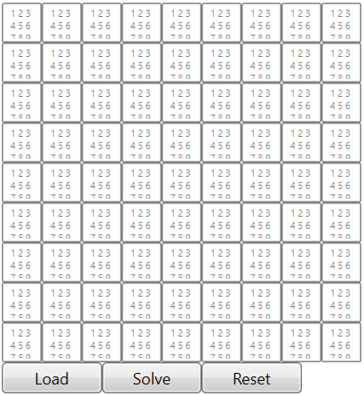
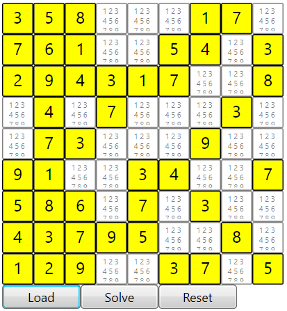
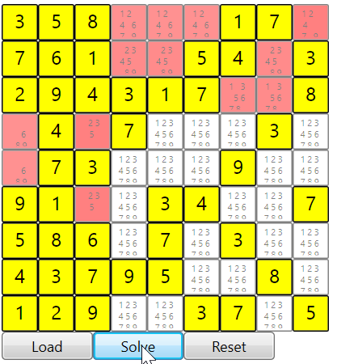
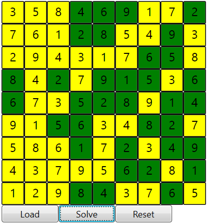

# Solver #

This is a C#/WPF sudoku solver application containing a library for solving problems. The library contains a set of algorithms and board mappings that can be used for general problem solving. Load the solution file "SolverLib.sln" into Microsoft Studio Community and build and run the application "SudukoApp". 

## Sudoku ##

It is used to solve sudoku by creating sets of rows, columns and grids which contain possible values of 1-9, each cell being a unique value. Click load to load the hard coded puzzle file "puzzles/puzzlefiend.txt". Click solve to run the algorithm to completion. Click reset to revert all values. Click in a cell and edit the possible values (1-9 separated with spaces) to change the puzzle as you wish. 

## Samauri Sudoku ##

The application can be used for Samauri Sudoku by changing the application view in the file `Window1.xaml.cs` to:
`UserControl view = new SamuraiSudokuView();`
Although there is no load function for samurai sudoku.

### Screen shots ###

1. Initial Screen. 

2. After clicking load. An initial cell with only one value is coloured yellow. If there are multiple values, the cell remains coloured white. 

3. Click solve and the puzzle becomes animated after each rule is applied to each cell.

4. When the cell is solved, it changes to green.

